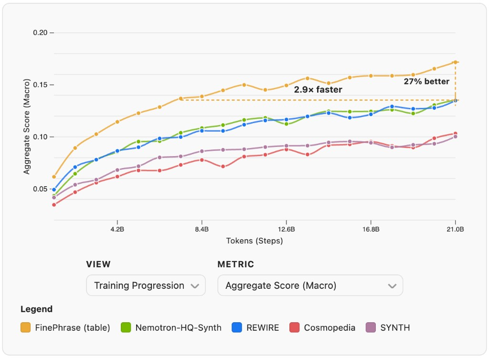

# FinePhrase
Synthetic pretraining data by rephrasing the web

[Blog post](https://huggingface.co/spaces/HuggingFaceFW/finephrase)



We ran 90 experiments, generated over 1 trillion tokens, and spent 12.7 GPU years to find the best recipe for synthetic pretraining data. The result is FinePhrase, a 486B token dataset that clearly outperforms all existing synthetic data baselines. It's [available on the Hub](https://huggingface.co/datasets/HuggingFaceFW/finephrase), and this post walks you through everything we learned along the way.

## Setup

### Install uv and setup a venv
```bash
curl -LsSf https://astral.sh/uv/install.sh | sh
uv venv --python 3.10
```

### Clone repos, apply patches, and install

FinePhrase depends on custom branches of nanotron, lighteval, and datatrove. Each needs a small patch on top:

| Patch                                              | Why                                                                              |
| -------------------------------------------------- | -------------------------------------------------------------------------------- |
| `datatrove-folder-dataset-repeat.patch`            | Wraps sample indices with modulo so nanotron blending doesn't `IndexError`        |
| `nanotron-recursive-dataloader.patch`              | Sets `recursive=True` so `build_dataset` discovers `.ds` files in subdirectories |
| `lighteval-trust-remote-code.patch`                | Removes `trust_remote_code` arg dropped in newer HF libraries                    |

From the FinePhrase repo root, on a GPU node (`srun --gpus=1 --qos=high --time="01:59:00" --pty bash && module load cuda/12.4`):

```bash
git clone -b nanotron-working-branch git@github.com:huggingface/nanotron.git
git clone -b lighteval-experiment-setup git@github.com:huggingface/lighteval.git
git clone -b fix-nanotron git@github.com:joelniklaus/datatrove.git

patch -p1 -d datatrove  < patches/datatrove-folder-dataset-repeat.patch
patch -p1 -d nanotron   < patches/nanotron-recursive-dataloader.patch
patch -p1 -d lighteval  < patches/lighteval-trust-remote-code.patch

uv pip install setuptools
uv pip install --find-links https://download.pytorch.org/whl/cu124/torch/ "torch==2.6.0+cu124"
uv pip install --find-links https://download.pytorch.org/whl/cu124/torchvision/ "torchvision==0.21.0+cu124"
uv pip install --no-build-isolation "flash_attn==2.7.4.post1"
uv pip install -e "nanotron" && uv pip install -e "lighteval[math,multilingual]" && uv pip install -e "datatrove[s3,io,processing]"
uv pip install -e .
```

### Test the installation
```bash
python -c "import nanotron"
```

## Project Structure

```
finephrase/                Python package
├── cli/                   CLI entry points (report_tokens, filter_dataset, ...)
├── utils.py               Shared paths, reader utilities, formatting helpers
├── quality_scores.py      FineWeb-Edu and DCLM quality classifiers
├── task_list.py           Lighteval custom task definitions
└── tasks.txt              Lighteval task list for evaluation
configs/                   YAML experiment matrices (rephrasing, training, tokenization)
prompts/                   Markdown prompt templates for rephrasing
patches/                   Patches for vendored dependencies
assets/                    Images for documentation
nanotron/                  Vendored training library
lighteval/                 Vendored evaluation harness
datatrove/                 Vendored data processing library
```

## Available Commands

After installation, you can use these console commands for different aspects of the data pipeline:

- `report-tokens`         - Report token statistics for datasets
- `filter`                - Filter datasets with selectable filters
- `iterate-prompt`        - Interactive prompt iteration with LLM feedback
- `rephrase`              - Rephrase datasets using LLM inference
- `inspect-data`          - Pretty-print a few documents from a dataset
- `tokenize`              - Tokenize datasets for training
- `train`                 - Train models via Slurm
- `evaluate`              - Evaluate checkpoints via Slurm
- `launch-experiments`    - Launch multiple Slurm experiments from YAML configs
- `collect-metadata`      - Collect rephrasing run metadata into a JSON file
- `audit-contamination`   - N-gram overlap audit between training data and eval benchmarks

All commands support `--help` to see available options. Below, we walk through them in the order of a typical workflow: first understand your data, then prepare, rephrase, train, and evaluate.

### `report-tokens`

Before doing anything, you need to know how many tokens you are working with:

```bash
report-tokens --data s3://path/to/dataset1,hf://datasets/owner/dataset2
```

### `filter`

Once you know token counts, carve out the subset you want to rephrase. Supported filters include:
- `fineweb_edu_hq` (FineWeb-Edu HQ: rounded int_score 4,5)
- `fineweb_edu_lq` (FineWeb-Edu LQ: rounded int_score 0,1)
- `noop` (no filtering, copy all data)

**HQ data**:
```bash
filter \
  --data hf://datasets/HuggingFaceFW/fineweb-edu/data \
  --filter fineweb_edu_hq \
  --name fineweb-edu-hq-20BT \
  --subset-tokens 21.5e9 \
  --total-tokens 217715141792
```

**LQ data**:
```bash
filter \
  --data s3://fineweb-data-processing-us-east-1/edu_annotated/score1_2 \
  --filter fineweb_edu_lq \
  --name fineweb-edu-lq-20BT \
  --subset-tokens 21.5e9 \
  --total-tokens 1644271223950
```

**Noop filter (copy all data)**:
```bash
filter \
  --data hf://datasets/mlfoundations/dclm-baseline-1.0-parquet/filtered/OH_eli5_vs_rw_v2_bigram_200k_train/fasttext_openhermes_reddit_eli5_vs_rw_v2_bigram_200k_train/processed_data/global-shard_01_of_10/local-shard_0_of_10 \
  --filter noop \
  --name dclm-37BT

filter \
  --data hf://datasets/HuggingFaceTB/cosmopedia/data \
  --filter noop \
  --name cosmopedia-25BT
```

**Data sources:**
- Hub (fineweb-edu): all dumps with score >=3
- Hub (fineweb-edu-score-2): all dumps with score >= 2
- S3 bucket: new dumps, data for all scores (score1_2 for <3, score3 for >=3)

Note: Token counting is handled separately via `report-tokens`.

### `iterate-prompt`

Before launching a large rephrasing run, refine your prompt on a handful of documents first:

```bash
iterate-prompt --prompt format/faq.md --model-size 1b --data-path hf://datasets/HuggingFaceFW/fineweb-edu
```

### `rephrase`

With a tuned prompt and a filtered dataset, launch the rephrasing pipeline at scale:

```bash
rephrase --data s3://finephrase/experiments/filtered/fineweb-edu-lq-20BT --prompt dspy/rephrase/gemma-3-1b-it/budget-10.md --name dspy-rephrase-budget-10 --debug
```

Available prompts for data quality improvement:

*For LQ data:*
- `prompts/rewire/guided_rewrite_corrected.md` - Guided rewriting with expert reasoning
- `prompts/nemotron/wikipedia_style_rephrasing.md` - Wikipedia-style paraphrasing
- `prompts/dspy/5-max_full_evals.md` - DSPy GEPA optimized prompt

*For HQ data:*
- `prompts/nemotron/distill.md` - Text condensation and paraphrasing
- `prompts/nemotron/extract_knowledge.md` - Knowledge extraction and rewriting
- `prompts/nemotron/diverse_qa_pairs.md` - Question-answer pair generation
- `prompts/nemotron/knowledge_list.md` - Factual information extraction
- `prompts/nemotron/wikipedia_style_rephrasing.md` - Wikipedia-style paraphrasing

### `inspect-data`

Spot-check the rephrased output before committing to tokenization:

```bash
inspect-data --data s3://finephrase/experiments/rephrased/dspy/rephrase/gemma-3-27b-it/ --limit 5
```

### `tokenize`

When the rephrased data looks good, tokenize it into the binary format nanotron expects:

```bash
tokenize --data s3://finephrase/experiments/filtered/fineweb-edu-hq-20BT --name fw_edu_hq
tokenize --data s3://finephrase/experiments/filtered/fineweb-edu-lq-20BT --name fw_edu_lq
```

### `train`

Now kick off pretraining on the tokenized data. This submits a Slurm job that trains Qwen-size models (`0.5b`, `1.7b`, `2.9b`, `6.2b`) on your tokenized datasets.
The launcher prints the exact parameter count for the selected preset before submitting training.
Tensor parallelism and recomputation are configured per model preset in `finephrase/cli/train_model.py`.
Lighteval batch size in the generated Nanotron config scales with model size (`eval_batch_size` in `QWEN_SIZE_PRESETS`: e.g. `1.7b` → 8, `6.2b` → 2) to reduce eval OOM on larger models. Run names use a trailing `-0.5b` / `-1.7b` / `-2.9b` / `-6.2b` suffix; if missing, the `1.7b` preset is used.
All presets keep depth/head topology fixed and only scale `hidden_size` + `intermediate_size`.

Slurm jobs use `--qos low` by default, `--requeue`, and a script that picks the **latest** checkpoint under `s3://finephrase/experiments/checkpoints/<run>/` before each run. If that step is already `>= train_steps`, training is **skipped** (clean exit) so finished runs do not reload step-`train_steps` checkpoints and crash.

**Repeating / blended data:** Nanotron's blend builds sample indices up to `train_steps × global_batch_size` per dataset stream. With the `datatrove-folder-dataset-repeat.patch`, `DatatroveFolderDataset` maps any global index with `index % len(dataset)` before resolving the `.ds` file, so a smaller corpus is cycled instead of raising `IndexError` (same idea as `OldTokenizedBytesFolderDataset` in nanotron). Empty folders still fail with a clear `IndexError`.

```bash
train --data s3://finephrase/experiments/tokenized/fw_edu_hq --name fw_edu_hq
train --data s3://finephrase/experiments/tokenized/fw_edu_lq --name fw_edu_lq
train --data s3://finephrase/experiments/tokenized/fw_edu_hq --name fw_edu_hq_2.9b --model-size 2.9b
```

**Custom blending weights:** By default, multi-dataset runs blend uniformly (`1/N` per dataset). Pass `--data-weights` to override this with comma-separated weights matching the order of `--data`. Weight `0` disables a dataset, which makes it easy to sweep over a synthetic fraction with a fixed `--data` argument. Nanotron normalizes the weights internally; only the ratios matter.

```bash
train \
  --data s3://.../fw_edu_hq/,s3://.../math_smollm2_1.7b_hq/ \
  --data-weights "0.3,0.7" \
  --name mix-0.3-fw_edu_hq-0.7-math_smollm2_1.7b_hq
```

A 9-run synthetic-fraction sweep (10% → 90%) for the pair `fw_edu_hq + math_smollm2_1.7b_hq` is at the top of `configs/training.yaml`. Launch it with `launch-experiments configs/training.yaml`.

### `evaluate`

Training runs lighteval automatically at checkpoints, but if some evaluations fail you can re-run them manually:

```bash
evaluate --name fw_edu_hq,fw_edu_lq
```

`evaluate` infers the same preset from the run folder name (suffix like `-6.2b`). Override the batch size if needed: `evaluate --batch-size 1`.

Run all missing evaluations:
```bash
evaluate --all
```

### `launch-experiments`

To sweep over many configurations at once (e.g. different prompts, model sizes, datasets), define them in a YAML file and submit them all in one shot:

```bash
# Submit all Slurm jobs in a configuration
launch-experiments configs/rephrasing.yaml

# Test configuration without submitting jobs (dry run)
launch-experiments configs/rephrasing.yaml --dry-run

# Submit only specific experiments
launch-experiments configs/rephrasing.yaml --run-names "qwen3-1.7b-hq,smollm2-1.7b-hq"
```

### `collect-metadata`

After experiments finish, aggregate all run metadata (token counts, quality scores, GPU time, benchmark results) into a single JSON file for analysis:

```bash
collect-metadata
```

Output is written to `rephrasing_metadata.json` in the project root.

### `audit-contamination`

Quantify n-gram overlap between training corpora and the eval suite defined in
`finephrase/task_list.py`. Builds a hash index from every benchmark's questions,
answers, and query/label overlap n-grams, then for each dataset reports the
fraction of documents that contain at least one matching n-gram against each
benchmark.

```bash
# Step 1+2: build the n-gram index (once) and submit one slurm audit job per
# dataset. --sample-rates lets you equalise token budgets across datasets so
# rates are comparable (each row will scan ~5B tokens here).
audit-contamination \
  --audit-name n10-5BT \
  --n-grams 10 \
  --n-tasks 200 \
  --data "s3://.../table-smollm2-1.7b-hq/,s3://.../math-smollm2-1.7b-hq/,s3://.../tutorial-smollm2-1.7b-hq/,s3://.../faq-smollm2-1.7b-hq/,s3://.../dclm-37BT/,s3://.../fineweb-edu-hq-20BT/,s3://.../fineweb-edu-lq-20BT/,s3://.../cosmopedia-25BT/" \
  --names "table_smollm2,math_smollm2,tutorial_smollm2,faq_smollm2,dclm,fw_edu_hq,fw_edu_lq,cosmopedia" \
  --sample-rates "0.9847,0.9630,0.7243,0.6833,0.1589,0.2619,0.2698,0.2728"

# Step 3: once all audit slurm jobs have finished, aggregate the per-dataset
# stats.json files. The canonical JSON report is written to
# contamination_audit_report.json in the project root.
audit-contamination --audit-name n10-5BT --report-only
```

Defaults: `n_grams=10` (DCLM convention), `find_query_ngrams=False`,
`find_overlap_ngrams=True`. Query-only ngrams are off by default because
lighteval queries embed prompt-template boilerplate (e.g. `Question: ...
Answer:`) that creates a flood of spurious matches across unrelated tasks.
On the training side we additionally skip degenerate n-grams (single token
covers more than 60% of the window) to suppress artifacts from datatrove's
`simplify_text` collapsing digit runs to `0 0 0 ...`. Enable query ngrams with
`--find-query-ngrams` if you specifically want to catch question-text
contamination and accept that noise. Use `--skip-index` on follow-up runs to
reuse the existing `index_n<N>/` directory.

## Citation

```bibtex
@misc{niklaus2026_the_synthetic_data_playbook_generating_trillions_of_the_finest_tokens,
  title={The Synthetic Data Playbook: Generating Trillions of the Finest Tokens},
  author={Joel Niklaus and Guilherme Penedo and Hynek Kydlicek and Elie Bakouch and Lewis Tunstall and Ed Beeching and Thibaud Frere and Colin Raffel and Leandro von Werra and Thomas Wolf},
  year={2026},
}
```
